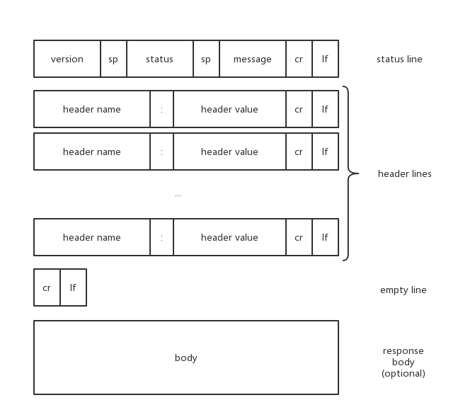

# http-features

## Introduction

- 超文本传输协议
- 请求/应答模式
- 统一资源标识符(URI)
- 无状态
- 元数据支持
- 分布式
- 多媒体，MIME类型

## Request

小问题：
- uri由哪些部分组成？
- query的键可重复么？header的键可重复么？[关于HTTP Parameter的安全性](https://www.slideshare.net/embyte/http-parameter-pollution-vulnerabilities-in-web-applications-black-hat-eu-2011)
- header与body间的空行是否是必须的？请求的解析过程是怎样的？

## Response

小问题：
- 在body存在的情况下，Content-Length首部是必须的么？
- chunked response的格式是怎样的？

## Method

- GET 查询指定资源
- POST 创建新资源
- HEAD 查询指定资源（仅返回元数据）
- PUT 更新或创建资源
- DELETE 删除资源
- OPTIONS 查询服务器支持的HTTP方法
- TRACE 
- PATCH 资源的部分更新
- CONNECT 变更为TCP/IP

安全的方法：GET，HEAD，OPTIONS

应设计为幂等的方法：PUT，DELETE

## Status

- 101 更换协议（例如建立websocket时）
- 200 成功
- 201 成功，资源被创建
- 301 永久重定向
- 302 临时重定向
- 304 资源未被修改（与Last-Modified或Etag联合使用）
- 307 临时重定向（复制原请求，HTTP/1.1）
- 400 错误请求
- 401 未认证
- 403 无权限
- 404 资源不存在
- 500 服务器内部错误
- ...

[wikipedia解释](https://en.wikipedia.org/wiki/List_of_HTTP_status_codes)

## Header

- Host
- Accept
- Connection
- Transfer-Encoding
- Content-Type
- Content-Length
- Expires, Cache-Control
- Last-Modified, If-Modified-Since
- Etag, If-Match, If-None-Match

## Cookie

- 状态的存储和转移
- session token
- 安全性
- domain, path, expires, httpOnly, secure

小问题：
- 用户登陆的过程中，cookie是怎样设置的？
- 如何覆盖一个已有的cookie？
- 浏览器是如何判断cookie过期的？

## Connection

- TCP连接

TCP提供提供了可靠的数据传输管道：包括超时重传，分组确认，拥塞控制等。

- 性能

HTTP事务时延包含：DNS解析、TCP连接、HTTP请求发送、HTTP响应回送。

TCP握手时延

TCP慢启动

Nagle算法

TIME_WAIT累积与端口耗尽：基准测试时常发生

- 并行连接

浏览器默认使用，并将总数设置为一个较小的值。

- 持久连接

HTTP/1.0 keep-alive：客户端发送首部Connection: Keep-Alive
向服务端申请将TCP连接保持在打开状态。
服务端返回首部Connection: Keep-Alive表示同意。否则客户端需要关闭该连接。
客户端需要正确编码Content-Length，媒体类型以及分块传输编码，
否则服务端无法正确检测报文的起始和终止。
代理与网关需要正确处理Connection首部。

盲中继。当代理无法正确处理Connection首部时，将简单转发，并等待连接关闭，
导致其后的请求被挂起。

为避免该情况，代理被要求绝不转发Connection首部和出现在Connection值中的首部。

HTTP/1.1 持久连接：默认激活。如要关闭连接，需要显式指明Connection: close首部。
正确的实体长度，Content-Length才能使连接持久保持。

- 管道化连接

HTTP/1.1 允许在持久连接上使用请求管道，即在响应到达前发送下一个请求，以提高性能。

## Cache

- 冗余的数据传输

- 带宽瓶颈

- 瞬间拥塞

可支持8个明星同时出轨的新浪微博...

- 距离时延

从波士顿到旧金山距离2700英里，光速来回仍需要30毫秒

- 命中、未命中与再验证

- 公有缓存、私有缓存和多级缓存

## Proxy

- 反向代理

- HTTP隧道

